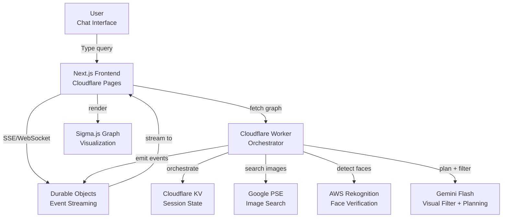
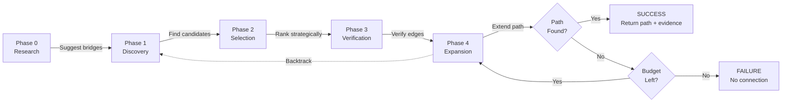
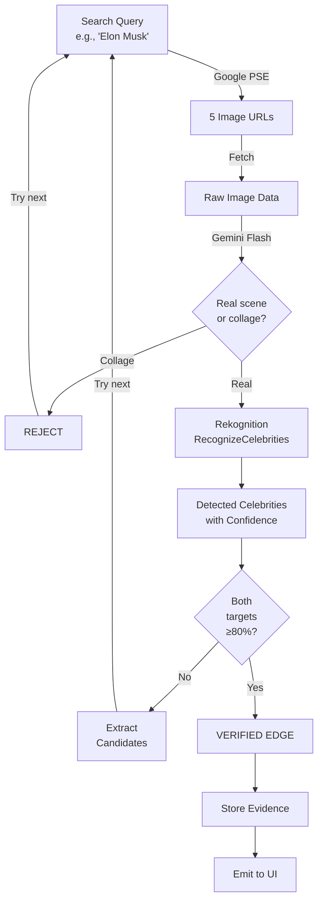
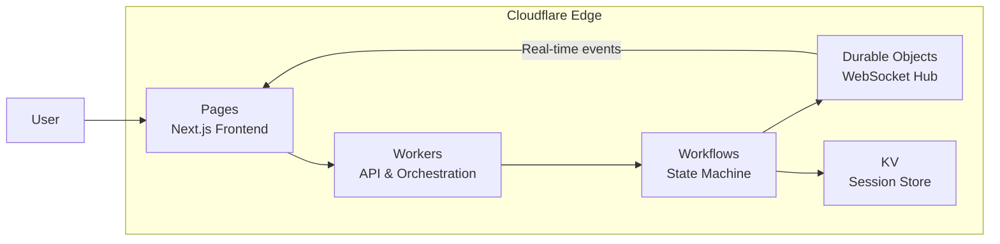
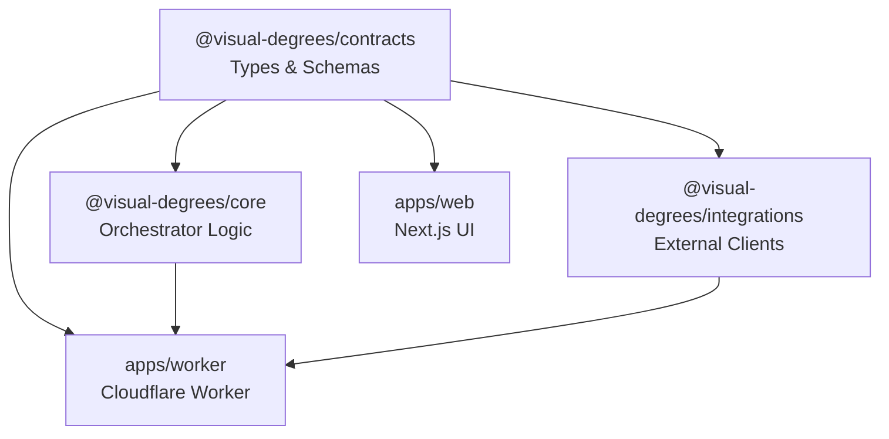

# Visual Degrees

A chat-first investigation system that finds **visual degrees of separation** between public figures using live image search, celebrity face verification, and AI-guided reasoning.

## What It Does

Given two public figures (e.g., "Elon Musk" and "Beyonce"), the system returns a **verified path** with:
- Evidence-backed connections (images where both people appear together)
- Confidence scores based on face recognition (≥80% threshold)
- Real-time streaming progress via chat interface
- Interactive graph visualization

Every connection is backed by **visual evidence** - no hallucinated relationships.

## Demo

[](https://www.youtube.com/watch?v=ClhDXklbhmo)

> Click the image above to watch the demo on YouTube

## Architecture Overview



## Investigation Pipeline



## Evidence Verification Flow



## Tech Stack

| Layer | Technology | Purpose |
|-------|------------|---------|
| **Frontend** | Next.js 15 + React 18 | Chat UI with streaming |
| **Styling** | Tailwind CSS 4 + Radix UI | Component library |
| **Graph** | Sigma.js + Graphology | Force-directed visualization |
| **Backend** | Cloudflare Workers | Serverless orchestration |
| **State** | Cloudflare KV + Durable Objects | Session state + real-time streaming |
| **Image Search** | Google Programmable Search Engine | Finding photos |
| **Face Detection** | AWS Rekognition | Celebrity identification |
| **Visual Filter** | Gemini Flash | Collage/montage detection |
| **Planning** | Gemini 2.0 Flash | Strategic candidate ranking |

## Built on Cloudflare

This project leverages the full Cloudflare developer platform for a serverless, globally distributed architecture:

| Service | Usage | Why It Matters |
|---------|-------|----------------|
| **[Workers](https://workers.cloudflare.com/)** | API orchestration & business logic | Sub-50ms cold starts, runs at the edge closest to users |
| **[Workflows](https://developers.cloudflare.com/workflows/)** | Investigation state machine | Durable execution with automatic retries, perfect for multi-step AI pipelines |
| **[Durable Objects](https://developers.cloudflare.com/durable-objects/)** | Real-time WebSocket streaming | Per-investigation isolation, consistent state for live event broadcasting |
| **[KV](https://developers.cloudflare.com/kv/)** | Session state & rate limiting | Global, low-latency key-value storage with TTL support |
| **[Pages](https://pages.cloudflare.com/)** | Next.js frontend hosting | Git-integrated deployment with edge rendering |



### Why Cloudflare?

- **Zero infrastructure management** - No servers to provision or scale
- **Global by default** - Code runs in 300+ locations worldwide
- **Cost efficient** - Pay only for what you use, generous free tier
- **Integrated ecosystem** - Workers, KV, Durable Objects, and Workflows work seamlessly together

## Project Structure

```
who-is-connected-to-who/
├── apps/
│   ├── web/                    # Next.js chat UI
│   │   ├── src/
│   │   │   ├── app/           # Next.js app router
│   │   │   ├── components/    # UI components
│   │   │   │   ├── investigation-app.tsx
│   │   │   │   ├── social-graph.tsx
│   │   │   │   └── ui/        # shadcn components
│   │   │   ├── hooks/         # React hooks
│   │   │   └── lib/           # Utilities
│   │   └── package.json
│   │
│   └── worker/                 # Cloudflare Worker
│       ├── src/
│       │   ├── index.ts       # API routes
│       │   ├── workflows/     # Investigation state machine
│       │   ├── durable-objects/
│       │   └── tools/         # Service integrations
│       └── wrangler.toml
│
├── packages/
│   ├── contracts/             # Shared TypeScript types
│   ├── core/                  # Investigation logic
│   └── integrations/          # External API clients
│
└── docs/context/              # Architecture documentation
```

## Monorepo Dependencies



## Getting Started

### Prerequisites

- Node.js 18+
- pnpm 8+
- Cloudflare account
- API keys for:
  - Google Programmable Search Engine
  - AWS Rekognition
  - OpenRouter (for Gemini access)

### Installation

```bash
# Clone the repository
git clone https://github.com/nintang/who-is-connected-to-who.git
cd who-is-connected-to-who

# Install dependencies
pnpm install

# Build packages
pnpm build
```

### Environment Setup

Create `apps/worker/.dev.vars`:

```env
# Google Programmable Search Engine
GOOGLE_API_KEY=your_google_api_key
GOOGLE_CX=your_search_engine_id

# AWS Rekognition
AWS_ACCESS_KEY_ID=your_aws_access_key
AWS_SECRET_ACCESS_KEY=your_aws_secret_key

# OpenRouter (Gemini 2.0 Flash)
OPENROUTER_API_KEY=your_openrouter_key
OPENROUTER_MODEL=google/gemini-2.5-flash-lite

# Gemini (optional fallback)
GEMINI_API_KEY=your_gemini_key
```

### Running Locally

```bash
# Start the worker (in one terminal)
cd apps/worker
pnpm dev

# Start the web app (in another terminal)
cd apps/web
pnpm dev
```

Visit `http://localhost:3000` to use the app.

### Deployment

```bash
# Deploy worker to Cloudflare
cd apps/worker
pnpm deploy

# Deploy web app to Cloudflare Pages
cd apps/web
pnpm deploy
```

## API Endpoints

| Endpoint | Method | Description |
|----------|--------|-------------|
| `/api/chat/query` | POST | Start an investigation |
| `/api/chat/stream/:runId` | GET | SSE event stream |
| `/api/chat/events/:runId` | GET | Poll-based events |
| `/api/chat/parse` | POST | Parse natural language query |
| `/api/graph` | GET | Get full verified graph |
| `/api/graph/path` | GET | Get shortest path between nodes |
| `/api/health` | GET | Service health check |

## Key Constraints

- **Max hops**: 6 (degrees of separation)
- **Confidence threshold**: ≥80% for face detection
- **Evidence requirement**: Visual proof for every connection
- **No preprocessing**: Graph is built on-demand per query

## Confidence Scoring

```
Per-Image Score = min(confidence_A, confidence_B)
Edge Confidence = max(per_image_score across all images)
Path Confidence = min(edge_confidence along path)
```

## Contributing

1. Fork the repository
2. Create a feature branch
3. Make your changes
4. Run tests: `pnpm test`
5. Submit a pull request

## License

MIT

## Acknowledgments

- [Sigma.js](https://www.sigmajs.org/) for graph visualization
- [Cloudflare Workers](https://workers.cloudflare.com/) for serverless infrastructure
- [AWS Rekognition](https://aws.amazon.com/rekognition/) for celebrity detection
- [Google Gemini](https://ai.google.dev/) for visual filtering and planning
