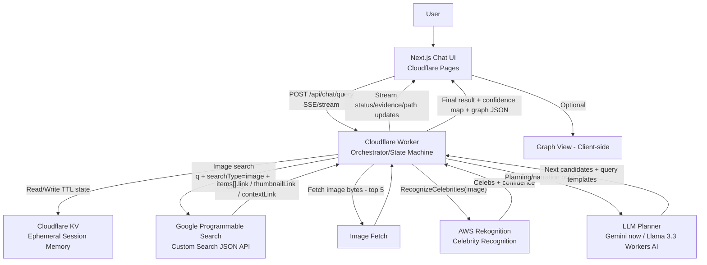

# 02_system_architecture.md

## Architecture Overview

**Visual Degrees** is a chat-first, on-demand “visual six degrees” system that builds a **verified connection path** between two **public figures** using:

* **Google Programmable Search (PSE)** for **image retrieval**
* **Amazon Rekognition (RecognizeCelebrities)** for **identity verification**
* **LLM (Gemini now; Llama 3.3 via Workers AI later)** for **guided expansion + narration**
* **Cloudflare Workers** as the **orchestrator/state machine**
* **Cloudflare KV** as **ephemeral query/session memory (TTL minutes)**
* **Next.js** for the frontend chat UI, deployed on **Cloudflare Pages**

No precomputed global graph is stored; the graph is constructed **lazily at query time** and emitted as a **post-run artifact** for optional graph view.

---

## Components and Responsibilities

### Frontend (Next.js on Cloudflare Pages)

**Responsibilities**

* Chat UI (input + streaming messages)
* Renders “evidence cards” (image thumbnail, confidence, source link)
* Renders final summary (path + confidence map)
* Optional graph view (client-side rendering from backend-provided graph JSON)

**Non-responsibilities**

* No search logic
* No CV
* No LLM calls directly (all via Worker API)

---

### Orchestrator API (Cloudflare Workers)

**Responsibilities**

* Implements bounded exploration (≤6 hops)
* Enforces constraints:

  * process first 5 images per search
  * confidence threshold ≥ 80%
  * no crowd penalty rules
* Calls external services:

  * Google PSE (retrieval)
  * Rekognition (verification)
  * LLM (planning/narration)
* Maintains session/query state via KV
* Streams progress + evidence events back to the UI
* Produces final artifact:

  * verified path
  * evidence set
  * confidence map
  * graph JSON payload

---

### Ephemeral State (Cloudflare KV)

**Responsibilities**

* Stores session/query-scoped state with TTL minutes:

  * visited queries
  * processed image URLs
  * candidate intermediates
  * verified edges (with evidence pointers)
  * partial paths and hop depth
* Prevents repeated work in multi-turn chat (same session)

**Constraints**

* Not a global relationship graph
* Not long-term storage

---

### LLM (Gemini now → Llama 3.3 on Workers AI later)

**Responsibilities**

* Guided expansion:

  * select next intermediate(s) from candidate list
  * propose next query templates
* Narration:

  * status updates
  * explanation of why a candidate was chosen
* Summarization:

  * final explanation strictly tied to verified evidence

**Prohibitions**

* No face identification
* No relationship claims beyond visual co-presence
* No edge creation without verified evidence

---

### Image Retrieval (Google Programmable Search Engine)

**Responsibilities**

* Retrieve candidate image URLs + thumbnails + context links for a query

**Constraints**

* Use `searchType=image`
* Process **only first 5 results** per expansion step

---

### Verification (Amazon Rekognition RecognizeCelebrities)

**Responsibilities**

* Detect celebrities present in an image
* Return name + confidence + bounding box per detected celebrity
* The only authority for “who is in the image”

**Constraints**

* Accept evidence only if both endpoints are detected ≥ 80%

---

## Data Flow (Text)

1. User enters query (Person A, Person B) in Next.js chat UI.
2. UI calls Worker API endpoint (session-based), requesting a connection.
3. Worker attempts direct retrieval: Google PSE `"A B"` → top 5 images.
4. Worker verifies each image via Rekognition:

   * If a direct edge is verified, produce final result.
   * Otherwise, Worker gathers candidate intermediates from Rekognition detections and uses LLM to select next expansions.
5. Worker repeats bounded expansion up to 6 hops.
6. Worker returns streaming updates (status, evidence cards, partial paths).
7. Worker emits final result with confidence map and a graph JSON payload.
8. Next.js UI optionally renders graph view from that payload.

---

## Mermaid Diagram (End-to-End Dataflow)

---

## Deployment Notes (High Level)

* **Next.js** deployed to **Cloudflare Pages**
* **Workers** exposes API routes (and streaming)
* **KV** bound to Worker for ephemeral state
* Secrets managed in Cloudflare:

  * Google API key + CX
  * AWS credentials (least privilege)
  * LLM provider keys (Gemini) until migration to Workers AI

---

