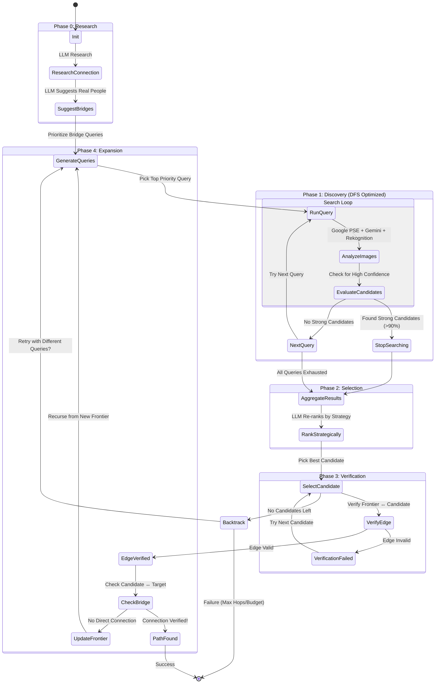

# Runtime Workflow State Machine

This diagram illustrates the optimized investigation workflow, including the **Intelligent Planner**, **Bridge Suggestions**, and **Early Stopping** optimizations.

## Key Optimizations

1. **Bridge Suggestions:**
   - Before searching, LLM suggests specific real people (e.g., "Kanye West") who likely connect the two targets.
   - These generate high-priority queries (`"Frontier Kanye West"`).

2. **Early Stopping (DFS):**
   - The search loop processes queries one-by-one.
   - If a query yields high-confidence candidates (e.g., >90%), we **stop searching** immediately.
   - This saves API budget by skipping lower-priority queries.

3. **Strategic Ranking:**
   - Candidates are re-ranked by the LLM based on their likelihood to connect to the final target (industry, social circles), not just visual confidence.
